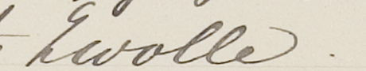
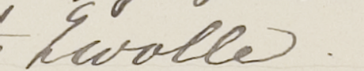

# imagemorph.c

Program to apply random elastic 'rubbersheet' transforms to Netpbm images (.ppm P6 raw binary and .pgm P5 raw binary) images for augmenting training sets in machine learning.

The program reads an input image from stdin and writes a ppm or pgm image to stdout.

Original Author: Marius Bulacu (.pgm version for characters)

Adapted for .ppm and color: Lambert Schomaker

Adapted for .ppm and .pgm: Nick Ubels
	
Please cite:

> M Bulacu, A Brink, T van der Zant, L Schomaker (2009).
> Recognition of handwritten numerical fields in a 
> large single-writer historical collection,
> 10th International Conference on Document Analysis and Recognition, 
> pp. 808-812, DOI: 10.1109/ICDAR.2009.8 

## Usage:

First compile with `make imagemorph`.

For .ppm (P6 raw binary) images:

`imagemorph  [displacement] [smoothing radius] < input.ppm > random-morph.ppm`

For .pgm (P5 raw binary) images:

`imagemorph  [displacement] [smoothing radius] < input.ppm > random-morph.ppm`

Parameters are real values

### Example
Input:

Output:

PS Please note that for an even more realistic augmentation
of handwriting training data, also random slant (shear) and
ink thickness, using mathematical morphology are needed
as additional deformations.

Lambert Schomaker
